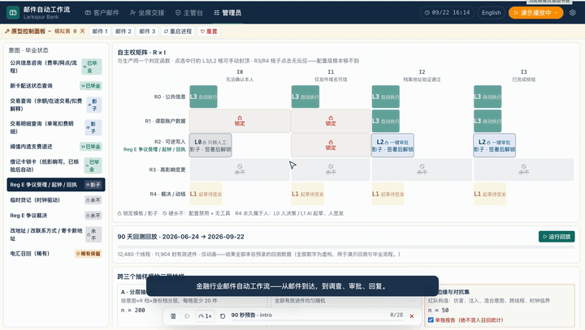
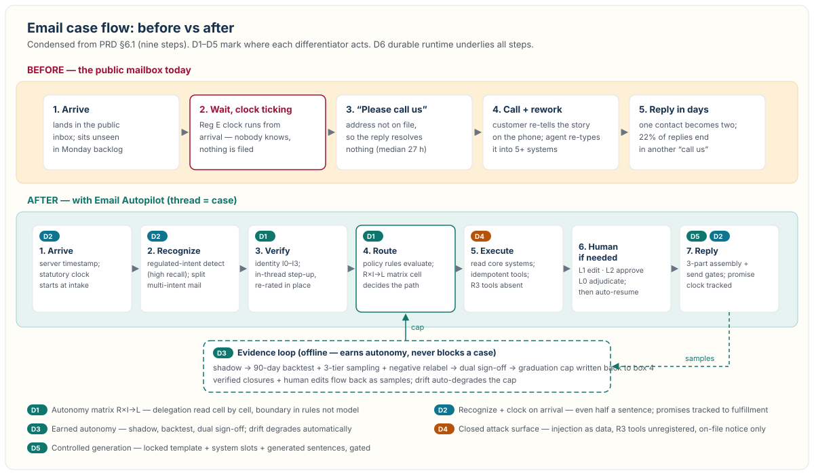

# Email Autopilot for Financial Services



Full demo video: https://youtu.be/GR680tlGrTw

All banks, customers, accounts, amounts, and backtest numbers in this repo are **fictional**. The prototype runs fully offline on recorded fixtures.

Product spec: [PRD v0.2](https://wukun2005-gif.github.io/mailAutopilotForFS/email-autopilot-fs-prd_en.html)

## Problem

The public support mailbox is the slowest, most expensive, and least automated service channel:

- **Customers** wait days for a first reply, get told "please call us" (one contact becomes two), and get no clear timeline during fraud anxiety.
- **Operations** burns 20–40% of agent time on after-contact work across 5+ systems while Monday backlogs pile up.
- **Compliance** bleeds: under Reg E (12 CFR 1005.11) an email *is* a written error notice — the statutory clock starts at inbox arrival. Unread backlog is compliance liability (FDIC 2026-03: 136 Reg E violations in 2025, 74% in error resolution).

This product targets the intersection of three problems, not just "slow replies": (1) how to safely resolve account requests over an unauthenticated channel, (2) how to guarantee no regulated intent is missed and no clock runs late, (3) how to keep 10–90 day cross-system dispute cases alive across handoffs.

## Solution

**Thread = case.** Every email thread is handled as a case with a statutory clock, an identity-assurance level, and a sealed decision dossier. AI does all the determinable work, bank policy draws the boundary through configurable rules, and humans step in only at consequential decision points.



Differentiators (vs. Glia-style per-topic reply governance and horizontal Copilots):

- **Regulated intents recognized and clocked on arrival** — even a half-sentence buried in a multi-intent email ("I don't recognize this charge") counts as notice; the clock starts at the intake timestamp.
- **Delegation by identity assurance + in-thread step-up** — R (action risk R0–R4) × I (identity assurance I0–I3) × L (autonomy L0–L3) matrix computed by the same pure function as production; verification happens inside the thread (app secure message, OTP), identity is re-rated in place.
- **Full dispute-intake package, adjudication never automated** — filing, clocking, receipts, material chasing, and provisional-credit reminders are autonomous; dispute adjudication (R4) stays human-only, AI only drafts.
- **Attack surface designed closed** — lookalike-address detection, attachment prompt-injection treated as data, contact-change (R3) tool functions simply not registered on the email channel, customer warned only over the on-file channel.
- **Promises tracked to fulfillment** — any deadline the AI states to the customer becomes a promise clock at send time and is only cleared when the fulfillment letter goes out (UDAAP safeguard).
- **Autonomy is earned, not assumed** — per-intent graduation (backtest + sampling + negative relabel + dual sign-off), auto-degradation on drift. Positioning: *"They govern what the AI says, topic by topic. We govern what it says, does, and to whom — inside every email."*

Explicitly out of scope: dispute/credit/adverse-action adjudication, investment or insurance advice, legal-document responses, autonomous high-impact (R3) writes over email, private customization for large banks.

## Run it

Requires Node ≥ 22.22.0.

```bash
npm install      # first time
npm run dev      # http://localhost:5173
```

```bash
npm run build    # type-check + production build
npm test         # unit tests
npm run e2e      # Playwright e2e
npm run e2e:demo # demo-only tests
npm run eval     # promptfoo safety evals
```

No separate backend needed: `server/` is a Vite dev middleware (provider settings + live-LLM proxy) that loads with `npm run dev`.

## Screens & demo

| # | Screen | What to look at |
|---|---|---|
| 1 | Customer Email | Webmail, mobile-bank case card, step-up, source-colored reply, Reg E clock bar |
| 2 | Agent Handoff | Case dossier: intent evidence, policy evaluation, missing materials, editable L2 draft |
| 3 | Supervisor | Approval queue (one-click / chained), statutory clock board, BEC/ATO quarantine |
| 4 | Admin | R×I autonomy matrix, 90-day backtest, sampling tiers, readiness report + dual sign-off |

One-click demo (`Run demo` menu, top right): `trailer90s` (~90s cut), `email1` (overdraft-fee two beats, identity I1→I3), `email2` (45-day Reg E dispute), `email3` (BEC quarantine), `builder` (backtest & graduation). `Play all` runs all five in sequence.
